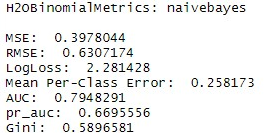
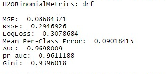
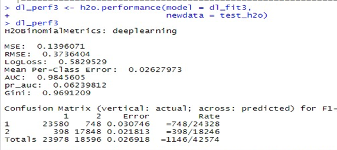

# Credit_Scorecard_Model
Using R language to create credit scorecard model using supervised learning technique by applying 3 algorithm (Naive Bayes, Random Forest and Multilayer perceptron). Utilizing standard package such as caret, ggplot and big data package in H2O to increase computation power by setting up cluster to run distributed parallel computing in local machine.
 
| Package       | Description                                 |
| ------------- |:-------------------------------------------:|
| H2O Package   | Distributed in memory processing & ML model |
| dplyr         | Data manipulation standard library          |
| Ggplot2       | Plotting the data                           |
| DMwR          | Handle Imbalance data (SMOTE Algorithm)     |
| Data.Table    | Data frame manipulation                     |         
 

Alt-H2 Result

