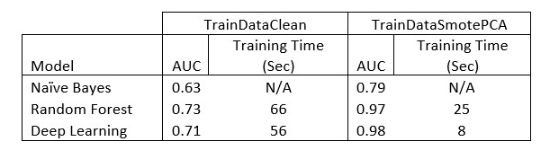

# Credit_Scorecard_Model
Using R language to create credit scorecard model using supervised learning technique by experimenting with 3 algorithm (Naive Bayes, Random Forest and Artificial Neural Network). Solve the issues of data imbalance by applying SMOTE algorithm together with principal component analysis (PCA) to reduce the dimension of the dataset. Then run an experiment to see the impact on performance of dataset with SMOTE & PCA. Result showed that there is an increase performance of the model with SMOTE & PCA treatment and Artificial Neural Network (ANN) worked best among other model that has been developed. 
 
| Package       | Description                                 |
| ------------- |:-------------------------------------------:|
| H2O Package   | Distributed in memory processing & ML model |
| dplyr         | Data manipulation standard library          |
| Ggplot2       | Plotting the data                           |
| DMwR          | Handle Imbalance data (SMOTE Algorithm)     |
| Data.Table    | Data frame manipulation                     |         
 

## Result
---------
### Naive Bayes Model
  
### Random Forest
  
### Artificial Neural Network
  
## Overall Result Table
  
